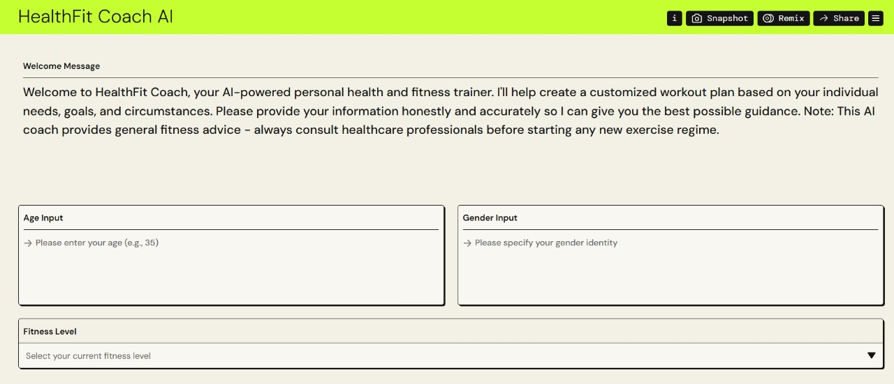
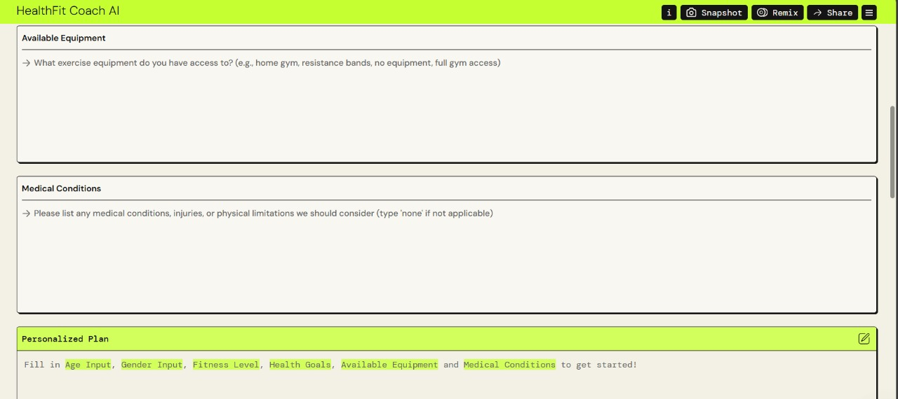
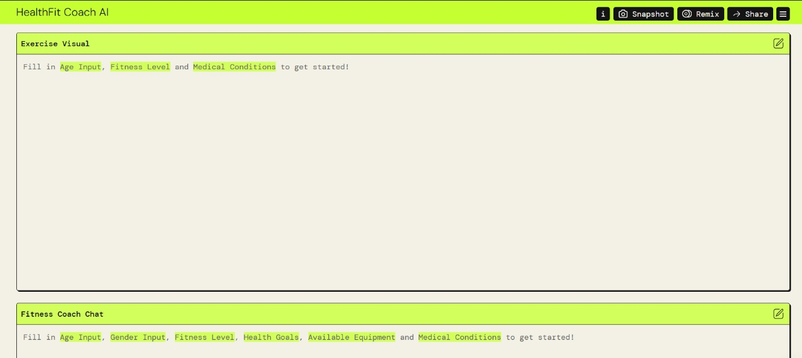

# 🧠 HealthFit Coach AI

Your **personal AI-powered fitness and wellness coach** — built with **Amazon PartyRock**.

> 🎯 **No cost. No sign-up. No waiting.**  
> Just pure, customized health guidance powered by AI.

---

## 🚀 What Makes It Unique

HealthFit Coach AI isn’t just another chatbot. It creates a fully **personalized** training and nutrition plan based on your:

- ✅ **Age**
- ✅ **Gender**
- ✅ **Fitness level**
- ✅ **Health goals**
- ✅ **Medical conditions**
- ✅ **Available equipment**

And here’s what makes it truly powerful:  
You also get your own **interactive LLM fitness assistant** — a smart AI coach you can ask follow-up questions like:

- “Can I swap running with cycling?”
- “What’s a good high-protein vegetarian snack?”
- “Is this exercise safe for my injury?”

All of this is 100% **free**, with **no account required**.  
Your own personal trainer, diet planner, and AI consultant — ready to help you anytime.

---

## 🧠 Key Features

- 🔄 Personalized fitness advice & workout plans
- 🍽️ Tailored diet and nutrition suggestions
- ♿ Supports medical conditions and limitations
- 💬 Built-in **LLM chatbot** to answer questions & clarifications
- 🛠️ Adapts to your fitness level and available equipment
- 🌐 No login, no cost — accessible to everyone
- ☁️ Powered by **Amazon PartyRock** and **Bedrock**

---

## 🛠️ Tech Stack

- **Amazon PartyRock** (Generative AI interface)
- **AWS Bedrock** (Foundation model APIs)
- Prompt Engineering and NLP
- Custom user profiling logic

---

## 🌐 Try It Now (Free!)

👉 [Launch HealthFit Coach AI](https://partyrock.aws/u/ziyadazzaz/yzOqRqoj9/HealthFit-Coach-AI)

---

## 📸 Demo Preview

---

## 💡 Inspiration

This project was created to explore how **Generative AI** can offer real-world impact — especially in **health, wellness, and fitness** — by delivering free, intelligent, and accessible coaching to **anyone, anywhere**.

---

## 👨‍💻 Author

**Ziyad Azzaz**  
🔗 LinkedIn: [linkedin.com/in/ZiyadAzzaz](https://www.linkedin.com/in/ziyad-azzaz)

---

> ✨ *Let’s make health and fitness smarter, simpler, and accessible to everyone — with AI.*
